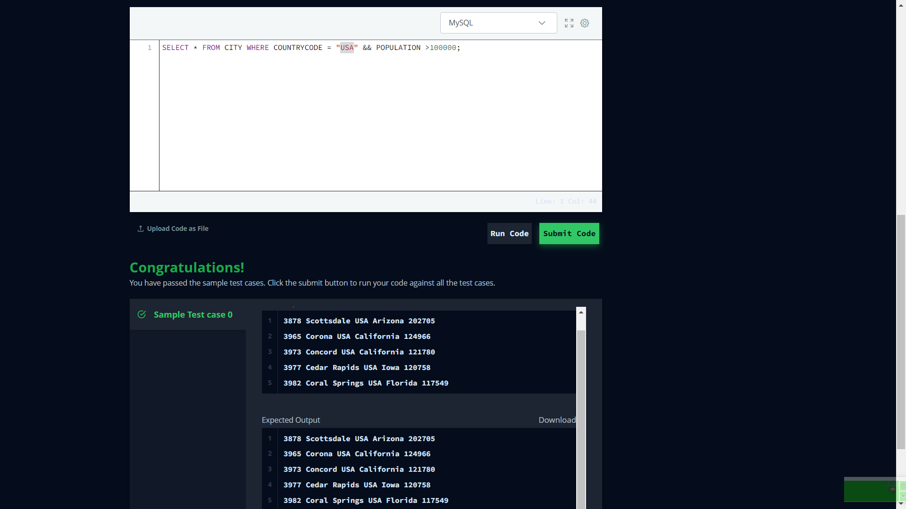
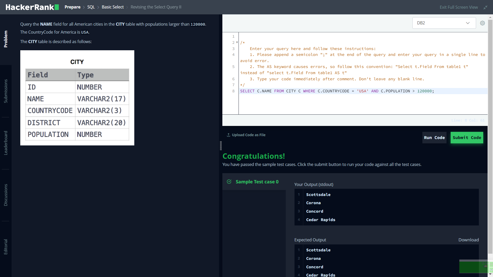
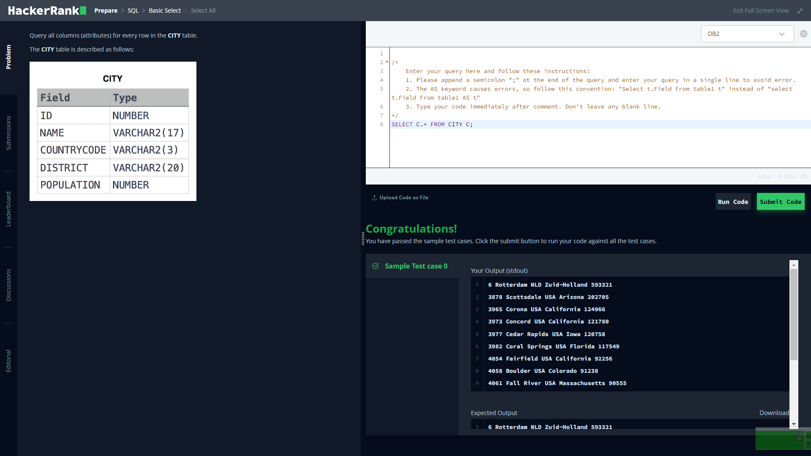
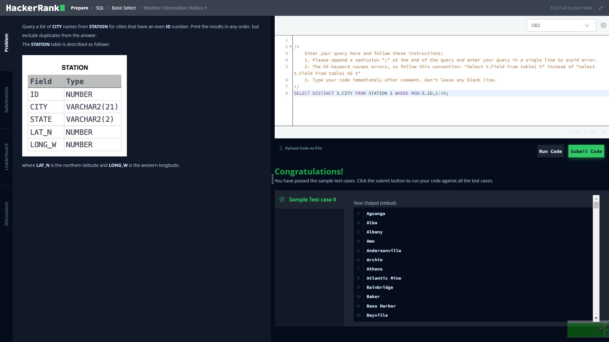
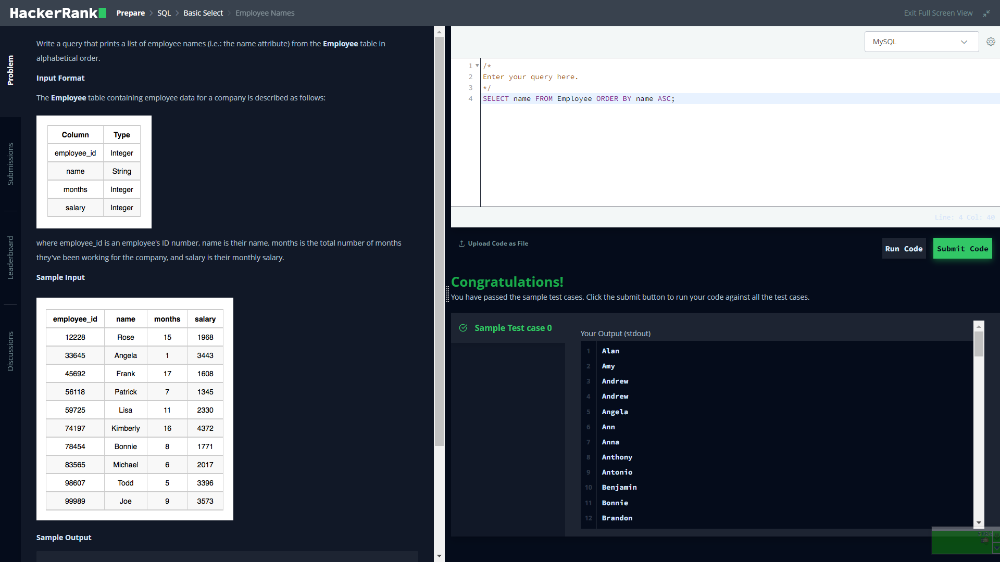
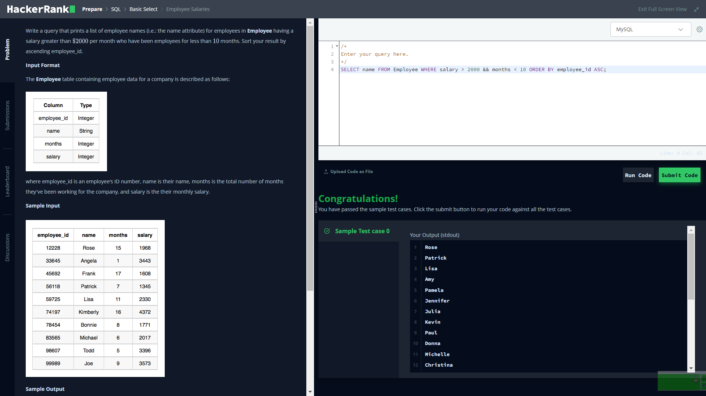
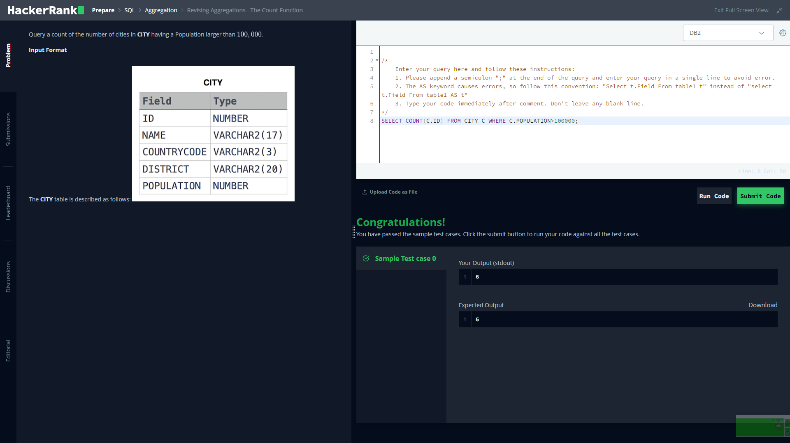
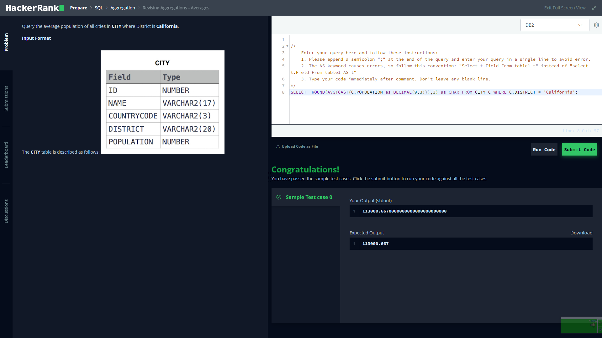
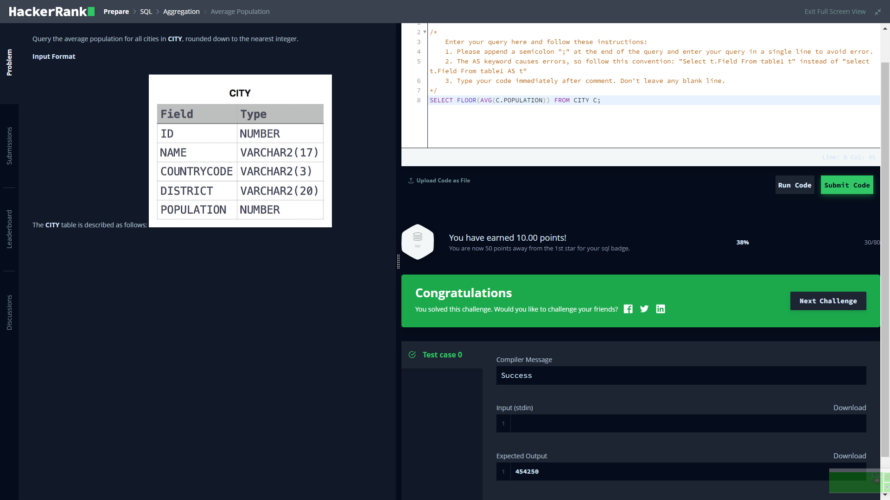

# Hackerrank 

I'm gonna answer some of hackerrank mysql questions

### section 1

#### Q1:
Query all columns for all American cities in the CITY table with populations larger than 100000. The CountryCode for America is USA.
```mysql
SELECT * FROM CITY WHERE COUNTRYCODE = 'USA' && POPULATION > 100000;
```


</br>
</br>
</br>
</br>
</br>
</br>

#### Q2:
Query the NAME field for all American cities in the CITY table with populations larger than 120000. The CountryCode for America is USA.
```mysql
SELECT C.NAME FROM CITY C WHERE C.COUNTRYCODE = 'USA' AND C.POPULATION > 120000;
```


</br>
</br>
</br>
</br>
</br>
</br>

#### Q3:
Query all columns (attributes) for every row in the CITY table.
```mysql
SELECT C.* FROM CITY C;
```


</br>
</br>
</br>
</br>
</br>
</br>

#### Q4:
Query all columns for a city in CITY with the ID 1661.

```mysql
SELECT C.* FROM CITY C WHERE C.ID = 1661;
```


</br>
</br>
</br>
</br>
</br>
</br>

### section 2

#### Q1:
Query a list of CITY names from STATION for cities that have an even ID number. Print the results in any order, but exclude duplicates from the answer.

```mysql
SELECT DISTINCT S.CITY FROM STATION S WHERE MOD(S.ID,2)=0 ORDER BY S.CITY ASC;
```


</br>
</br>
</br>
</br>
</br>
</br>

#### Q2:
Write a query that prints a list of employee names (i.e.: the name attribute) from the Employee table in alphabetical order.

```mysql
SELECT name FROM Employee ORDER BY name ASC;
```


</br>
</br>
</br>
</br>
</br>
</br>

#### Q3:
Write a query that prints a list of employee names (i.e.: the name attribute) for employees in Employee having a salary greater than $2000 per month who have been employees for less than 10 months. Sort your result by ascending employee_id.

```mysql
SELECT name FROM Employee WHERE salary > 2000 && months < 10 ORDER BY  employee_id ASC;
```


</br>
</br>
</br>
</br>
</br>
</br>

### section 3

#### Q1:
Query a count of the number of cities in CITY having a Population larger than 100,000

```mysql
SELECT COUNT(C.ID) FROM CITY C WHERE C.POPULATION > 100000;
```


</br>
</br>
</br>
</br>
</br>
</br>

#### Q2:
Query the total population of all cities in CITY where District is California.

```mysql
SELECT SUM(C.POPULATION) FROM CITY C WHERE C.DISTRICT = 'California';
```


</br>
</br>
</br>
</br>
</br>
</br>

#### Q3:
Query the average population of all cities in CITY where District is California.

```mysql
SELECT ROUND(AVG(CAST(C.POPULATION as DESIMAL(9,3))),3) FROM CITY C WHERE C.DISTRICT = 'California';
```


</br>
</br>
</br>
</br>
</br>
</br>

#### Q4:
Query the average population for all cities in CITY, rounded down to the nearest integer.

```mysql
SELECT FLOOR(AVG(C.POPULATION)) FROM CITY C;
```


</br>
</br>
</br>
</br>
</br>
</br>
