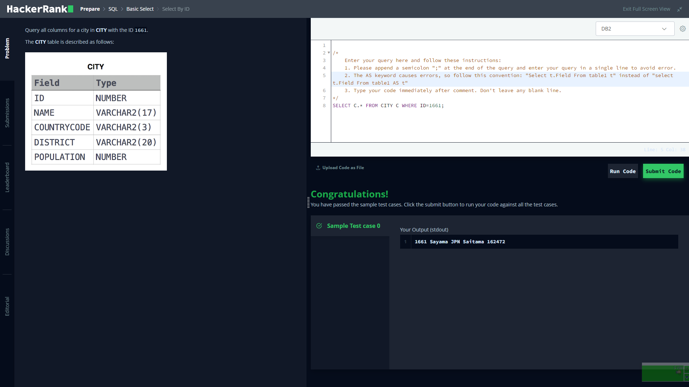

# Hackerrank 

I'm gonna answer some of hackerrank mysql questions

### section 1

#### Q1:
Query all columns for all American cities in the CITY table with populations larger than 100000. The CountryCode for America is USA.
```mysql
SELECT * FROM CITY WHERE COUNTRYCODE = 'USA' && POPULATION > 100000;
```


</br>
</br>
</br>
</br>
</br>
</br>

#### Q2:
Query the NAME field for all American cities in the CITY table with populations larger than 120000. The CountryCode for America is USA.
```mysql
SELECT C.NAME FROM CITY C WHERE C.COUNTRYCODE = 'USA' AND C.POPULATION > 120000;
```


</br>
</br>
</br>
</br>
</br>
</br>

#### Q3:
Query all columns (attributes) for every row in the CITY table.
```mysql
SELECT C.* FROM CITY C;
```


</br>
</br>
</br>
</br>
</br>
</br>

#### Q4:
Query all columns for a city in CITY with the ID 1661.

```mysql
SELECT C.* FROM CITY C WHERE C.ID = 1661;
```


</br>
</br>
</br>
</br>
</br>
</br>
